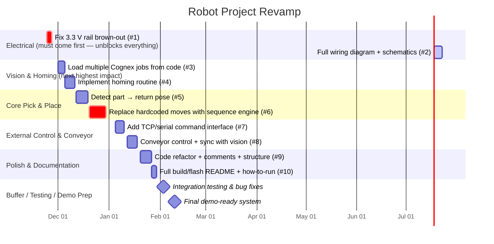

# roboticscell

# Gantt Chart

# Robot Cell Operating Proceedure

    1) Ensure breaker switch inside of left panel is flipped to the on position
    2) plug machine into wall outlet
    3) on the computer run the GUI.exe file (More details to come later)
    (Currently unsure if usb is isolated from VIN, If USB is plugged in and the Teensy has power skip step 2)
    4) press the power on button and wait aproximatly 2-3 seconds 
    5) you will know the machine is ready when the power on light turns off and the start and reset lights turn on.
    6) Gui window should display the starting information for the Teensy and will display any further serial outputs
    7) once ready to start, press the reset button. this will home the arm to the center
    (will add code to move the arm to the side to give the cognex a clearer view of the tray)
    8) press the start button to begin sorting
    (currently the arm starts at center and will only move to the object and stop. need to add a way for it to move the object then continue sorting.)
    9) if there is a non-emergency reason to stop the machine, press the stop button at any time and the machine will halt its actions. 
    (this will cause the stop button to blink until the stop button is pressed again. once it is pressed the second time normal operation can resume.)
    10) if there is an emergency reason to stop press the emergency stop button.
    (this will cut power to the motors and motor controllers)
    11) to come out of the emergency stop start, twist the emergency stop button to release it, then you will be prompted to press the reset button.
    12) after reset is pressed normal operation can resume.

# Ip Network Settings
    Cognex Camera
        Cognex IP: 192.168.1.50
    
    Teensy Controller
        Teensy IP: 192.168.1.40
        Port: 8888
    
    PC Settings
        ethernet Ip to 192.168.1.10
        Mask: 255.255.255.0
        Default Gateway: 192.168.1.1
    
    To connect to cognex camera set ethernet Ip settings to-
        Use insight explorer V6.5.1

# Information

    Teensy version 4.1

    To program with VScode/VScodium use platformio. The current version of platformio is not availible in the extension marketplace, instead download the .vsix file from: https://github.com/platformio/platformio-vscode-ide/releases, install the extension manually under the extension manager. PlatformIO version 3.3.4 was used in testing.
